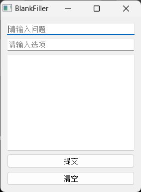

"英文完型填空" (也作"英文选词填空") 是国内英文考试的常见题型. 个人兴致使然, 我希望编写一个基于 BiLSTM-CRF 的自动化答题应用, 一方面巩固自己对课内知识的掌握, 另一方面也能在工程中理解模型的真实智能水平.

项目的主要工作在于手动实现了条件随机场 (Conditional Random Field, CRF) 组件的训练和推理算法, 并利用 PyQT5 编写了一个简单的用户界面.



模型由基于 Penn 词性标注集的 Brown 语料库训练而成, 该语料库包含共计 1,000,000 个英文单词.

受限于模型实现, 软件无法处理训练语料中未登录的单词, 因此在实际使用中的效果可能不太理想.

值得一提的是, 这个项目的实现过程受到了"[你的CRF层的学习率可能不够大](https://spaces.ac.cn/archives/7196)"一文的启发, 其中作者提供了为 BiLSTM 和 CRF 指派不同的超参数并分开训练的新思路.

# 如何使用本仓库?

本仓库支持 `Python 3.X` 版本, 使用如下命令即可安装仓库依赖:

```bash
pip install -r requirements.txt
```

> 对于资深用户, 你可以选择逐个检查并安装所需依赖. (你可能并不需要 `requirements.txt` 中所包含的 Pytorch CPU 版本.)

进入仓库目录, 执行如下命令即可运行程序:

```bash
python src/main.py
```

我训练的模型位于 `model` 目录下, 会被程序自动加载. 如果你希望重新训练模型, 清空 `model` 目录后再运行 `src/main.py` 即可. 你还可以修改文件中的超参数值, 以测试比对结果.

# 使用实例

使用 `()` 表示空缺位置, 一个句子只应出现一处空缺位. 

如果你正在使用自己搜集的问题句子和选项, 请注意将句子中的单词缩写手动纠正为全写, 并使用空格分隔单词和符号. 其他细节请参看下面的示例:

问题
```
Dear Sirs : let me begin by clearing up any possible misconception in your minds , () you are .
```

选项
```
wherever whatever at where
```

答案
```
Dear Sirs : let me begin by clearing up any possible misconception in your minds , wherever you are .
```

# 参考资料

[1] 邱锡鹏. 神经网络与深度学习[M]. 北京：机械工业出版社，2021.  
[2] CreateMoMo. (2017, Sep 12). CRF Layer on the Top of BiLSTM - 1. *CreateMoMo*. https://createmomo.github.io/2017/09/12/CRF_Layer_on_the_Top_of_BiLSTM_1//  
[3] CreateMoMo. (2017, Oct 8). CRF Layer on the Top of BiLSTM - 3. *CreateMoMo*. https://createmomo.github.io/2017/10/08/CRF-Layer-on-the-Top-of-BiLSTM-3//  
[4] CreateMoMo. (2017, Oct 17). CRF Layer on the Top of BiLSTM - 4. *CreateMoMo*. https://createmomo.github.io/2017/10/17/CRF-Layer-on-the-Top-of-BiLSTM-4//  
[5] CreateMoMo. (2017, Nov 11). CRF Layer on the Top of BiLSTM - 5. *CreateMoMo*. https://createmomo.github.io/2017/11/11/CRF-Layer-on-the-Top-of-BiLSTM-5//  
[6] CreateMoMo. (2017, Nov 24). CRF Layer on the Top of BiLSTM - 6. *CreateMoMo*. https://createmomo.github.io/2017/11/24/CRF-Layer-on-the-Top-of-BiLSTM-6//  
[7] CreateMoMo. (2017, Dec 6). CRF Layer on the Top of BiLSTM - 7. *CreateMoMo*. https://createmomo.github.io/2017/12/06/CRF-Layer-on-the-Top-of-BiLSTM-7//  
[8] CreateMoMo. (2017, Dec 7). CRF Layer on the Top of BiLSTM - 8. *CreateMoMo*. https://createmomo.github.io/2017/12/07/CRF-Layer-on-the-Top-of-BiLSTM-8//  
[9] 苏剑林. (Feb. 07, 2020). 《你的CRF层的学习率可能不够大 》[Blog post]. Retrieved from https://spaces.ac.cn/archives/7196  
[10] Kristopher Kyle. (2021, Apr 7). Introduction to POS Tagging. *Corpus-Linguistics-Working-Group*. https://kristopherkyle.github.io/Corpus-Linguistics-Working-Group/pos_tagging_1.html  
