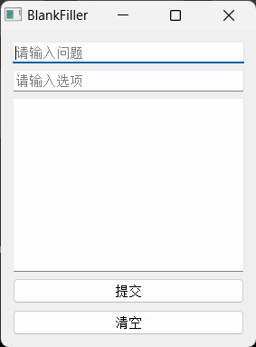
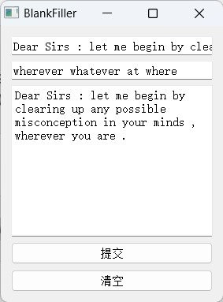

"英文完型填空" (也作"英文选词填空") 是国内英文考试的常见题型. 

个人兴致使然, 我希望编写一个基于 BiLSTM-CRF 的自动化答题应用。这样一方面巩固自己对课内知识的掌握, 另一方面也能在工程中理解模型的真实智能水平.

最终用户界面如下图所示：



本项目的主要工作在于：对于条件随机场 (Conditional Random Field, CRF) 组件和 BiLSTM 组件，实现了通过不同超参数分别训练和推理的机制. 该实现过程受到了"[你的CRF层的学习率可能不够大](https://spaces.ac.cn/archives/7196)"一文的启发, 其中作者提供了为 BiLSTM 和 CRF 指派不同的超参数并分开训练的新思路. 

推理模型由基于 Penn 词性标注集的 Brown 语料库训练而成, 该语料库包含共计 1,000,000 个英文单词，模型在验证集上的最佳准确率为 93.25%.


受限于模型实现, 软件无法处理训练语料中未登录的单词, 因此在实际使用中的效果可能不太理想.

# 软件使用介绍

使用 `()` 表示空缺位置, 一个句子只应出现一处空缺位. 

请注意将句子中的单词缩写手动纠正为全写, 中文标点纠正为英文标点, 并使用空格隔开标点符号. 具体格式请参看下面的示例:

问题
```
Dear Sirs : let me begin by clearing up any possible misconception in your minds , () you are .
```

选项
```
wherever whatever at where
```

答案
```
Dear Sirs : let me begin by clearing up any possible misconception in your minds , wherever you are .
```



# 如何使用本仓库?

本仓库支持 `Python 3.X` 版本, 使用如下命令即可安装仓库依赖:

```bash
pip install -r requirements.txt
```

> 对于资深用户, 你可以选择逐个检查并安装所需依赖. (你可能并不需要 `requirements.txt` 中所包含的 Pytorch CPU 版本.)

进入仓库目录, 执行如下命令即可试运行:

```bash
python src/main.py
```

需要说明的是，我训练的模型位于 `model` 目录下, 会被程序自动加载. 如果你希望重新训练模型, 清空 `model` 目录后再执行 `python src/main.py` 即可. 你还可以修改代码中指定的模型超参数, 以测试结果.

最后，如果你并未改动过项目源代码文件名称与其目录结构、或训练所用的数据集，且希望将自己训练好的模型也打包为一个 exe 程序，使用如下命令即可在 `dist` 目录下看到新生成的 `main.exe` 主程序和相关运行文件：

```bash
pip install pyinstaller

pyinstaller main.spec
```
要运行该 `main.exe`, 请将 `model` 和 `data` 目录也拷贝到 `dist` 目录下，这时点击 `main.exe` 即可运行。

# 参考资料

[1] 邱锡鹏. 神经网络与深度学习[M]. 北京：机械工业出版社，2021.  
[2] CreateMoMo. (2017, Sep 12). CRF Layer on the Top of BiLSTM - 1. *CreateMoMo*. https://createmomo.github.io/2017/09/12/CRF_Layer_on_the_Top_of_BiLSTM_1//  
[3] CreateMoMo. (2017, Oct 8). CRF Layer on the Top of BiLSTM - 3. *CreateMoMo*. https://createmomo.github.io/2017/10/08/CRF-Layer-on-the-Top-of-BiLSTM-3//  
[4] CreateMoMo. (2017, Oct 17). CRF Layer on the Top of BiLSTM - 4. *CreateMoMo*. https://createmomo.github.io/2017/10/17/CRF-Layer-on-the-Top-of-BiLSTM-4//  
[5] CreateMoMo. (2017, Nov 11). CRF Layer on the Top of BiLSTM - 5. *CreateMoMo*. https://createmomo.github.io/2017/11/11/CRF-Layer-on-the-Top-of-BiLSTM-5//  
[6] CreateMoMo. (2017, Nov 24). CRF Layer on the Top of BiLSTM - 6. *CreateMoMo*. https://createmomo.github.io/2017/11/24/CRF-Layer-on-the-Top-of-BiLSTM-6//  
[7] CreateMoMo. (2017, Dec 6). CRF Layer on the Top of BiLSTM - 7. *CreateMoMo*. https://createmomo.github.io/2017/12/06/CRF-Layer-on-the-Top-of-BiLSTM-7//  
[8] CreateMoMo. (2017, Dec 7). CRF Layer on the Top of BiLSTM - 8. *CreateMoMo*. https://createmomo.github.io/2017/12/07/CRF-Layer-on-the-Top-of-BiLSTM-8//  
[9] 苏剑林. (Feb. 07, 2020). 《你的CRF层的学习率可能不够大 》[Blog post]. Retrieved from https://spaces.ac.cn/archives/7196  
[10] Kristopher Kyle. (2021, Apr 7). Introduction to POS Tagging. *Corpus-Linguistics-Working-Group*. https://kristopherkyle.github.io/Corpus-Linguistics-Working-Group/pos_tagging_1.html  
[11] Pytorch Tutorials. (2017, Apr 8). Advanced: Making Dynamic Decisions and the Bi-LSTM CRF. *Pytorch Tutorials*. https://pytorch.org/tutorials/beginner/nlp/advanced_tutorial.html#advanced-making-dynamic-decisions-and-the-bi-lstm-crf  
[12] 虎哥. (2019, Dec 16). 手撕 BiLSTM-CRF. *知乎*. https://zhuanlan.zhihu.com/p/97676647  
